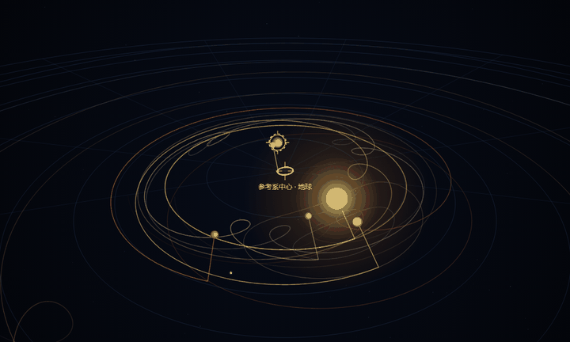
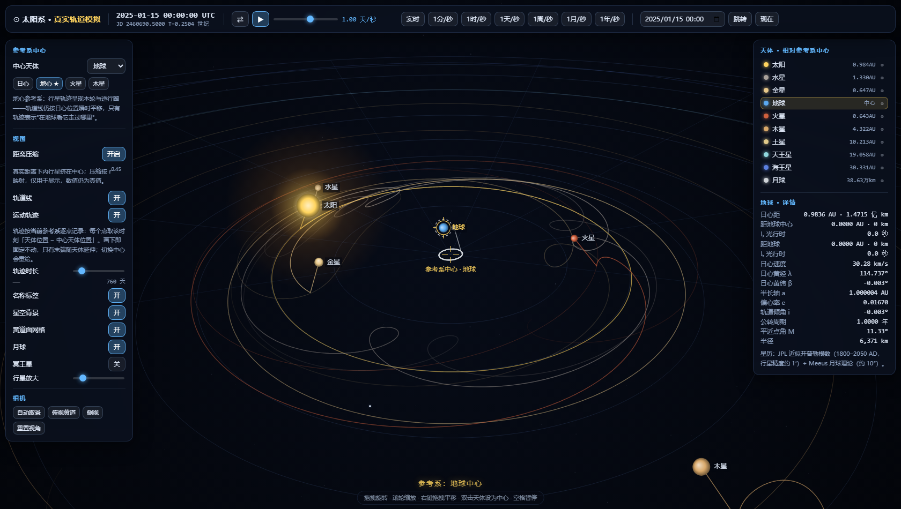
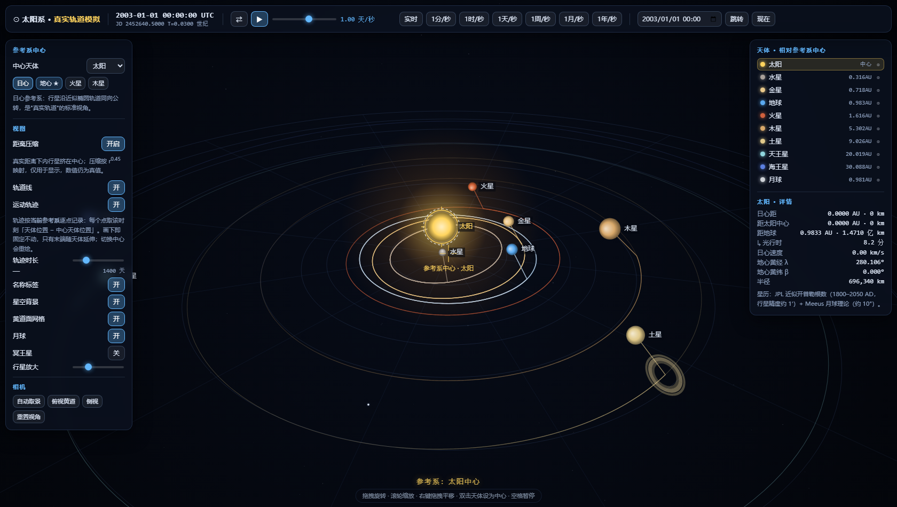
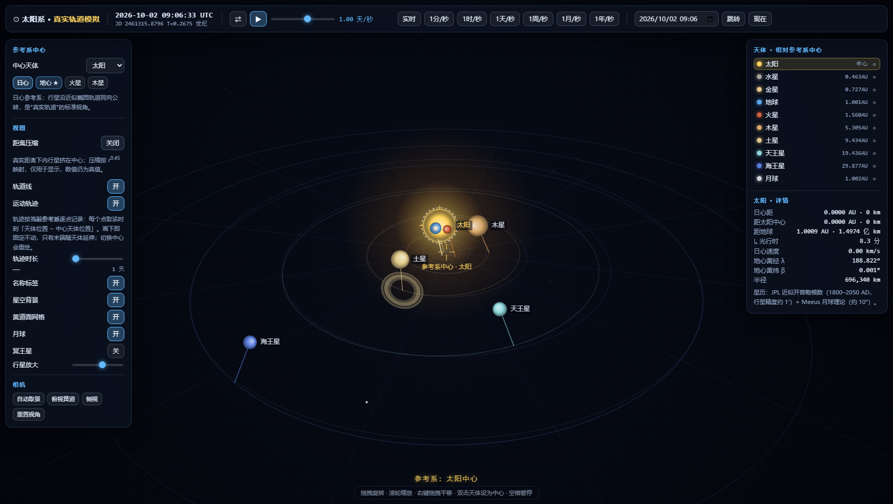
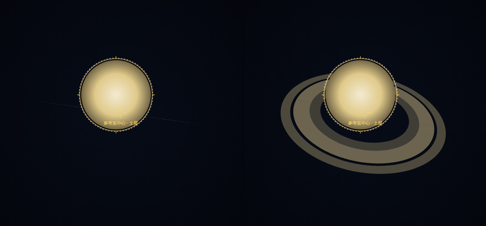
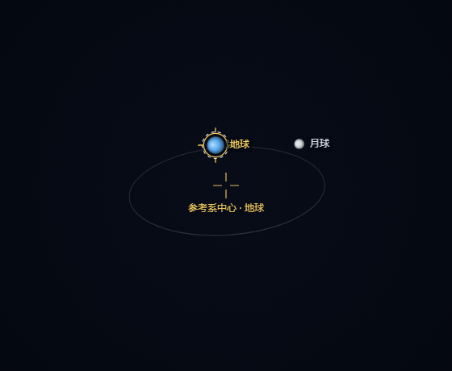

# 太阳系 · 真实轨道模拟器

**Solar System — a real-ephemeris simulator with switchable reference frames**

单文件、零依赖、可离线的太阳系模拟器。核心特色是**可以把参考系中心设成任意天体**——以地球为中心时，行星轨迹会画出经典的本轮与逆行圈。



*地心参考系下 780 天（一个火星会合周期）的演化：每颗行星都拖着一条自己走过的轨迹，火星的逆行圈清晰可见。*

---

## 这是什么

`index` 只有一个文件：`solar-system.html`。没有构建步骤、没有 CDN、没有 npm 依赖，双击就能运行，断网也能用。

位置不是画出来的动画，是**算出来的**：行星用 JPL 的近似开普勒根数求解开普勒方程，月球用 Meeus 月球理论，时间轴是真实儒略日。



## 特性

- **参考系切换**：太阳 / 八大行星 / 月球任意作为中心，双击天体即可切换。地心视角下行星呈本轮曲线与逆行圈。
- **真实星历**：JPL 近似开普勒根数（1800–2050 AD）+ Meeus 月球理论（黄经 17 项、黄纬 7 项、距离 10 项）。
- **轨迹属于参考系**：每个轨迹点取「该时刻天体位置 − 该时刻中心天体位置」。点一画下就固定不动，只有末端随天体延伸——这正是地心坐标的定义。
- **时间控制**：实时到约 4500 天/秒，可倒流、可跳转到任意日期。
- **实时数值面板**：距参考系中心的 AU / km / **光行时**、日心与地心黄经黄纬、轨道根数、公转周期。
- **距离压缩显示**：真实比例下内行星会挤成一团，可一键切换 r^0.45 压缩视图（数值始终为真值）。
- **星空背景**：31 颗真实亮星（含北斗、猎户座）按 J2000 赤经赤纬换算到黄道坐标。
- **土星环**：按真实环边界绘制 C / B / A 环并留出卡西尼缝，环面朝向由土星自转极决定。
- 触屏支持：单指旋转、双指缩放。



## 快速开始

```bash
# 方式一：直接双击 solar-system.html

# 方式二：起个本地服务器（可选，效果完全一样）
python -m http.server 8000
# 然后访问 http://localhost:8000/
```

在线演示：**https://moliyopher.github.io/solar-system/**

> 这是纯前端单文件应用，所有计算都在浏览器里完成，不上传任何数据。

## 操作

| 操作 | 效果 |
|---|---|
| 拖拽 | 旋转视角 |
| 滚轮 / 双指捏合 | 缩放 |
| 右键拖拽 / Shift+拖拽 | 平移 |
| 单击天体 | 选中并在右侧显示详情 |
| **双击天体** | **把该天体设为参考系中心** |
| 空格 | 暂停 / 继续 |
| `←` `→` | 时间步进 |
| `+` `-` | 加减速 |
| `F` / `R` | 自动取景 / 重置视角 |
| `C` | 循环切换参考系中心 |

## URL 参数

状态可以写进地址栏分享，例如
`solar-system.html#center=earth&date=2025-01-15&trail=900&dist=3.4`

| 参数 | 说明 |
|---|---|
| `center` | `sun` / 行星 id / `moon` |
| `date` | `2024-11-15` 或 `2024-11-15T08:30`（UTC） |
| `jd` | 直接给儒略日 |
| `trail` | 轨迹时长（天） |
| `speed` | 天/秒，负数为倒流；`pause=1` 可暂停 |
| `compress` | `0` 关闭距离压缩，显示真实比例 |
| `dist` `yaw` `pitch` | 相机距离与角度 |
| `showOrbits` `showTrails` `showLabels` `showStars` `showGrid` `showMoon` `showPluto` | `0` 关闭对应图层 |
| `size` | 行星放大倍数 |
| `ui` | `0` 隐藏全部界面，只留纯场景（截图 / 嵌入网页用） |
| `debug` | 把投影诊断写入页面标题（自动化用） |



## 更多演示

**土星环**是真实的 3D 环平面，朝向由土星自转极决定。下面两幅是同一时刻、只改变相机位置：相机落入环平面时环收成一条细线，抬高视角则环面展开（C / B / A 环与卡西尼缝）。



**地月系统**：把中心设为地球并拉近，可以看到月球真实的受扰轨道（不是理想圆）。



## 精度与验证

这个项目的重点不是"看起来像"，而是**可被检验**。仓库里带两个验证套件：

```bash
node verify-ephemeris.js   # 32 项星历检验
node verify-ui.js          # 13 项界面回归（需本机有 Chrome 或 Edge）
```

星历部分的对照物是**独立编写的 Meeus 太阳位置公式**与公认天文事实，而非自证：

| 检验项 | 本模型 | 参考值 |
|---|---|---|
| 太阳黄经最大偏差（1800–2050，逐 10 年采样） | 0.003° | — |
| 2024 年地球近日点距离 | 0.98330 AU | 0.98330 AU |
| 地球近日点 / 远日点速度 | 30.29 / 29.29 km/s | 30.29 / 29.29 km/s |
| 火星 2025 年最近距 | 01-12，0.6423 AU | 01-12，0.642 AU |
| 木星 2024 年最近距 | 12-06，4.0867 AU | 4.089 AU |
| 2024-04-08 日全食朔时刻 | 误差 **0.26 分钟** | 天文年历 |
| 2025-03-29 日偏食朔时刻 | 误差 0.35 分钟 | 天文年历 |
| 朔时月球黄纬（2024-04-08） | 0.354° | 日全食 gamma = 0.343 |
| 七颗行星会合周期 | 误差 < 0.05 天 | — |
| 月地距极值 | 356,347 / 405,978 km | 约 356,400 / 406,200 km |

日食那一项同时验证了整条链路：地球轨道相位、月球黄经与黄纬、以及两者的参考系一致性——因为月球理论给出的是**当日平春分点**黄经，而行星根数在 **J2000** 框架，直接混用会让朔时刻系统性偏早约 35 分钟。

`verify-ui.js` 覆盖的是界面层的失败路径：畸形分享链接、超出 ISO 可表示范围的日期、以隐藏天体为中心等。

## 数据来源

- 行星根数：JPL, *Approximate Positions of the Planets*（1800–2050 AD 表，日心黄道 J2000）
- 月球：Meeus, *Astronomical Algorithms* 第 47 章（截断级数）
- 亮星：J2000 赤经赤纬，自行换算到黄道坐标

## 已知限制

- **地月质心**：JPL 根数描述的是地月质心，而月球位置是相对地心的，两者混用会带来 ≤4700 km 的绝对偏移（地月相对几何仍自洽，所以食相时刻不受影响）。
- **精度区间**：根数在 1800–2050 之外会明显退化，界面会给出提示。
- **土星环张开角由相机决定**，不随日期变化——因为这是自由相机、固定在黄道坐标系中。想复现 2025 年 3 月那种"从地球看环面侧向"的景象，需要把相机放进环平面。
- 月球轨道线画的是它一个月内的**真实受扰路径**，而行星轨道线是**瞬时开普勒椭圆**，两者含义不同。
- 忽略 ΔT（UT 与 TT 之差约 69 秒）。对"日月黄经相合"这类相对几何事件，两者共用同一时间自变量，误差恰好抵消。

## 目录结构

```
index.html                     跳转页，让 GitHub Pages 根地址可用
solar-system.html              主程序（单文件，零依赖）
verify-ephemeris.js            星历检验，32 项断言
verify-ui.js                   界面回归，13 项断言（无头 Chrome）
tools/pngdiff.js               PNG 逐像素差异分析（验证轨迹是否漂移时写的）
tools/make-demo-assets.py      把截图合成 README 用的动图与对比图
shots/                         README 演示图
```

## 作者说明

天文计算部分力求可检验，界面部分刻意保持单文件、零依赖。发现问题欢迎开 issue。

## License

[MIT](LICENSE)
